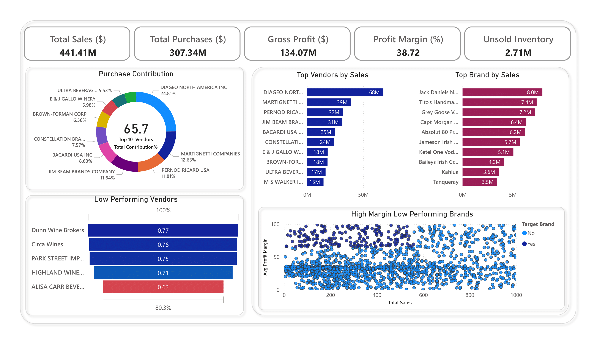

# 🧾 Vendor Performance Analysis – Retail Inventory & Sales

_Analyzing vendor efficiency and profitability to support strategic purchasing and inventory decisions using SQL, Python, and Power BI._

---

## 📌 Table of Contents
- <a href="#overview">Overview</a>
- <a href="#business-problem">Business Problem</a>
- <a href="#dataset">Dataset</a>
- <a href="#tools--technologies">Tools & Technologies</a>
- <a href="#project-structure">Project Structure</a>
- <a href="#data-cleaning--preparation">Data Cleaning & Preparation</a>
- <a href="#exploratory-data-analysis-eda">Exploratory Data Analysis (EDA)</a>
- <a href="#research-questions--key-findings">Research Questions & Key Findings</a>
- <a href="#dashboard">Dashboard</a>
- <a href="#how-to-run-this-project">How to Run This Project</a>
- <a href="#final-recommendations">Final Recommendations</a>
- <a href="#author--contact">Author & Contact</a>

---
<h2><a class="anchor" id="overview"></a>Overview</h2>

This project evaluates vendor performance and retail inventory dynamics to drive strategic insights for purchasing, pricing, and inventory optimization. A complete data pipeline was built using SQL for ETL, Python for analysis and hypothesis testing, and Power BI for visualization.

---
<h2><a class="anchor" id="business-problem"></a>Business Problem</h2>

Effective inventory and sales management are critical in the retail sector. This project aims to:
- Identify underperforming brands needing pricing or promotional adjustments
- Determine vendor contributions to sales and profits
- Analyze the cost-benefit of bulk purchasing
- Investigate inventory turnover inefficiencies
- Statistically validate differences in vendor profitability

---
<h2><a class="anchor" id="dataset"></a>Dataset</h2>

- Multiple CSV files located in `/data/` folder (sales, vendors, inventory)
- Summary table created from ingested data and used for analysis

This project uses the *Vendor Performance Dataset* originally uploaded on Kaggle:  
[Vendor Performance Data on Kaggle](https://www.kaggle.com/datasets/ansarianam/vendor-performance-data)  

⚠️ **Note:** The dataset is large (~1.6 GB for sales.csv). Please download all the files directly from Kaggle and place the files in the `data/` folder before running the notebooks.

⚠️ **Important:** This repo contains **sample CSV files** in `sample_data/` for testing.  
To run the full dataset, delete `./inventory.db` and `./vendor_sales_summary`, then replace the sample CSVs in `./data/` with files downloaded from Kaggle.


---

<h2><a class="anchor" id="tools--technologies"></a>Tools & Technologies</h2>

- SQL (Common Table Expressions, Joins, Filtering)
- Python (Pandas, Matplotlib, Seaborn, SciPy)
- Power BI (Interactive Visualizations)
- GitHub

---
<h2><a class="anchor" id="project-structure"></a>Project Structure</h2>

```
vendor-performance-analysis/
│
├── README.md
├── .gitignore
├── requirements.txt
├── Vendor Performance Report.pdf
│
├── notebooks/                  # Jupyter notebooks
│   ├── Exploratory_Data_Analysis.ipynb
│   ├── Vendor Performance Analysis.ipynb
│
├── scripts/                    # Python scripts for ingestion and processing
│   ├── ingestion_db.py
│   └── get_vendor_summary.py
│
├── dashboard/                  # Power BI dashboard file
│   └── vendor_performance.pbix
│ 
├── sample_data/
│   ├── begin_inventory.csv
│   ├── end_inventory.csv
│   ├── purchase_prices.csv
│   ├── purchases
│   ├── sales
│   └── vendor_invoice
```

---
<h2><a class="anchor" id="data-cleaning--preparation"></a>Data Cleaning & Preparation</h2>

- Removed transactions with:
  - Gross Profit ≤ 0
  - Profit Margin ≤ 0
  - Sales Quantity = 0
- Created summary tables with vendor-level metrics
- Converted data types, handled outliers, merged lookup tables

---
<h2><a class="anchor" id="exploratory-data-analysis-eda"></a>Exploratory Data Analysis (EDA)</h2>

**Negative or Zero Values Detected:**
- Gross Profit: Min -52,002.78 (loss-making sales)
- Profit Margin: Min -∞ (sales at zero or below cost)
- Unsold Inventory: Indicating slow-moving stock

**Outliers Identified:**
- High Freight Costs (up to 257K)
- Large Purchase/Actual Prices

**Correlation Analysis:**
- Weak between Purchase Price & Profit
- Strong between Purchase Qty & Sales Qty (0.999)
- Negative between Profit Margin & Sales Price (-0.179)

---
<h2><a class="anchor" id="research-questions--key-findings"></a>Research Questions & Key Findings</h2>

1. **Brands for Promotions**: 198 brands with low sales but high profit margins
2. **Top Vendors**: Top 10 vendors = 65.69% of purchases → risk of over-reliance
3. **Bulk Purchasing Impact**: 72% cost savings per unit in large orders
4. **Inventory Turnover**: $2.71M worth of unsold inventory
5. **Vendor Profitability**:
   - High Vendors: Mean Margin = 31.17%
   - Low Vendors: Mean Margin = 41.55%
6. **Hypothesis Testing**: Statistically significant difference in profit margins → distinct vendor strategies

---
<h2><a class="anchor" id="dashboard"></a>Dashboard</h2>

- Power BI Dashboard shows:
  - Vendor-wise Sales and Margins
  - Inventory Turnover
  - Bulk Purchase Savings
  - Performance Heatmaps



---
<h2><a class="anchor" id="how-to-run-this-project"></a>How to Run This Project</h2>

1. Clone the repository:
```bash
git clone https://github.com/mathursakaar15/liquor-vendor-performance-analysis-sql-python-powerbi.git
```
2. Install dependencies:
```bash
pip install -r requirements.txt
```
3. Download the [Kaggle Dataset](https://www.kaggle.com/datasets/ansarianam/vendor-performance-data) and create `data` folder inside root directory

4. Paste the CSVs into `data` folder and ingest into database:
```bash
py scripts/ingestion_db.py
```
5. Create vendor summary table:
```bash
py scripts/get_vendor_summary.py
```
6. Open and run notebooks:
   - `notebooks/Exploratory_Data_Analysis.ipynb`
   - `notebooks/Vendor Performance Analysis.ipynb`
7. Open Power BI Dashboard:
   - `dashboard/vendor_performance.pbix`
   - If prompted, change source to `./vendor_sales_summary`

---
<h2><a class="anchor" id="final-recommendations"></a>Final Recommendations</h2>

- Diversify vendor base to reduce risk
- Optimize bulk order strategies
- Reprice slow-moving, high-margin brands
- Clear unsold inventory strategically
- Improve marketing for underperforming vendors

---
<h2><a class="anchor" id="author--contact"></a>Author & Contact</h2>

**Sakaar Mathur**    
📧 Email: mathursakaar@gmail.com  
🔗 [LinkedIn](https://www.linkedin.com/in/sakaar-mathur-85a9b720a/)
